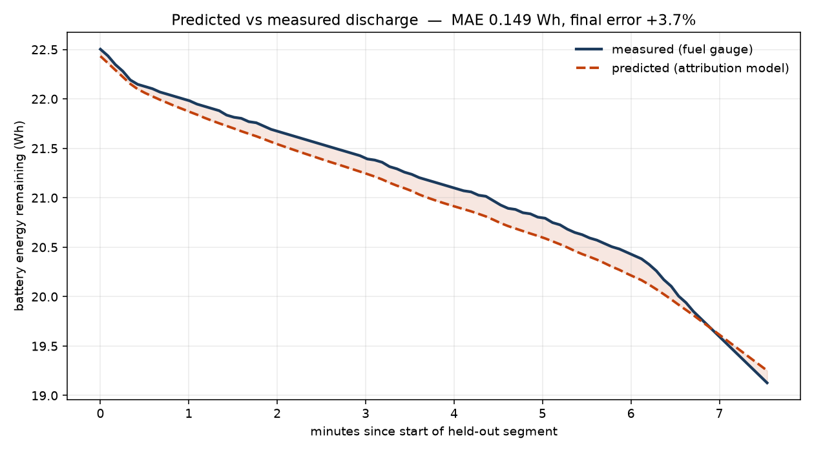

# Stormbreaker

Per-process battery attribution for Linux, learned per machine.

Tells you what is actually draining your battery, in watts rather than CPU
percent:

```
    WATTS   SHARE     CPU     GPU   IO MB/s                APPLICATION
    3.415   36.2%   1.040   0.043      0.72  ####........  org.chromium.Chromium
    1.303   13.8%   0.112   0.000      0.00  ##..........  plasma-kwin_wayland
    0.588    6.2%   0.242   0.167      0.13  #...........  google-chrome
    0.370    3.9%   0.098   0.002      0.09  ............  code
    0.308    3.3%   0.127   0.000      0.00  ............  tab(186946)
    3.036   32.2%                            ####........  [idle baseline — attributable to nobody]
```

Note what ranking by watts does that ranking by CPU cannot: `google-chrome` uses
less than a quarter of a core, yet outranks `code` on power, because its GPU
time costs more than the other's arithmetic. A CPU-percent view would order
these differently and be wrong about the battery.

And the corresponding battery report:

```
  Top offenders:
    1. org.chromium.Chromium         1.18 W    18.4 min of battery consumed
       close it to gain ~7 min of runtime
```

## Does it work?



The model was fitted on the first part of an unplugged session, then asked to
predict the next **27.6 minutes** of battery trajectory it had never seen. It
tracks two separate load transitions — the elbow at ~2.5 min and the sharp drop
at ~8.5 min — and lands within **4.2%** on final energy.

Tracking *changes* in drain rate is the claim that matters. Two straight lines
agreeing proves nothing, and an early version of this plot on an idle machine
produced exactly that.

That validates the **total**. The split between individual applications is a
separate and weaker claim, measured at 10-25% error — see
[How wrong is the per-application split?](#how-wrong-is-the-per-application-split)
before quoting any single application's watts.

## Why this needs a model at all

You cannot measure per-process power. The hardware reports one number for the
whole package. Windows and macOS solve this with proprietary attribution
models; powertop on Linux uses hard-coded constants from 2010-era hardware.

So the coefficients have to be learned, per machine, because a 15 W ultrabook
and a 45 W workstation have completely different cost structures. Stormbreaker
regresses the one number the hardware *does* give you onto per-cgroup activity
vectors:

```
measured_watts[t] = baseline + SUM_k SUM_j  w[k,j] * activity[t,k,j]
```

What makes the coefficients physically meaningful rather than merely predictive
is the constraint set:

- **Non-negativity.** Nothing consumes negative power. Without this, collinear
  features produce large positive and negative coefficients that cancel — which
  predicts well and attributes nonsense.
- **A free baseline.** The static draw of an idle machine belongs to nobody, so
  it is fitted as an unpenalised intercept and cannot be smeared across
  applications.
- **`baseline <= min(observed power)`.** Exact, and follows directly from every
  other term being non-negative. An earlier build violated it — claiming a
  7.66 W idle floor on a machine never seen drawing under 5.24 W.
- **An activity floor.** A process using a thousandth of a core cannot have its
  cost identified. Such columns are dropped rather than fitted.
- **Ridge scaled per feature *kind*, not per column.** Textbook per-column
  normalisation is actively wrong here: it rescales a nearly-idle application's
  near-empty column up to parity with a saturated one, so the penalty stops
  restraining its watts-per-core. That is how a daemon doing nothing was once
  assigned 23,938 W per core. Columns of one kind share a scale, so the penalty
  expresses the prior actually held — no application should have an extreme cost
  *per unit of work* relative to its peers.

Solved with bounded-variable least squares (`scipy.optimize.lsq_linear`), which
is NNLS plus the upper bounds. Fits in milliseconds on a few thousand windows.

## What it collects

Locally, into SQLite, a few MB per week. Nothing leaves the machine.

**Energy targets**, in order of preference — the first readable one wins:

| Source | Notes |
|---|---|
| `powercap` RAPL `energy_uj` | Most direct, but **root-only** on kernels carrying the CVE-2020-8694 mitigation |
| hwmon package power (`power1_average`) | Same silicon, usually **world-readable**. On AMD APUs this is the SMU's PPT sensor |
| battery `power_now`, or `current_now * voltage_now` | Whole system including panel and radios; used as cross-check and for validation |

**Per-cgroup features**, all from cgroup v2 leaves so the tree is partitioned
exactly once:

| Feature | Source |
|---|---|
| CPU seconds, bucketed by clock frequency | `cpu.stat`, bucketed by sampled CPU frequency |
| Bytes read/written | `io.stat`, with device-mapper layers skipped to avoid double counting |
| Context switches | `/proc/PID/status`, differenced per pid |
| GPU engine time | `drm-engine-*` in `/proc/PID/fdinfo`, differenced per DRM client |

Package temperature (`k10temp`/`coretemp`) is recorded per window and is used by
the **system model**, though not by the per-application attribution. A package
sensor cannot see the fans, and fan power tracks temperature rather than
instantaneous compute. Adding the term lifted held-out system-model R^2 from
0.885 to 0.927 and, more importantly, cut a systematic +0.96 W under-prediction
to -0.30 W — which is what closed most of the gap in the plot above.

Two caveats kept deliberately visible. Package power and temperature are
strongly collinear here (r = 0.94), so the coefficient is partly a proxy for
sustained load rather than a clean fan measurement; it earns its place on
held-out accuracy, not on a claim about which watts are whose.

And an earlier attempt to test temperature against the *attribution* residual
was **confounded and is not evidence**: on an idle recording the model explained
0.4% of variance, so the residual was essentially the signal itself
(`corr(y, residual) = 0.987`) and duly correlated with temperature at 0.85 —
as it would with any quantity that tracks power. Noted because the confounded
version looks persuasive.

Frequency bucketing matters because the energy cost of a busy core is strongly
superlinear in clock: a core-second at 5 GHz and one at 1.2 GHz are different
goods and must not share a coefficient.

Counters that cannot be differenced in aggregate are not. Context switches and
GPU time are differenced per-pid and per-client respectively, because a process
exiting makes an aggregate total *fall* and a process starting makes it *jump* —
both of which corrupt a naive delta.

## Memory traffic: a negative result

Memory bandwidth is the largest power consumer not modelled here, so it was the
obvious next feature. It is worth recording what happened, because the outcome
was to *not* ship it.

**True bandwidth is out of reach unprivileged.** This CPU advertises hardware
memory-bandwidth monitoring (`cqm_mbm_total`, `rdt_a`) and exposes `amd_umc`
uncore PMUs, but reading either needs root — resctrl must be mounted, and
`perf_event_paranoid=2` blocks the uncore counters. The best per-cgroup signal
available without privileges is `memory.stat`'s page-fault count.

**Page faults are a proxy for allocation churn, not bandwidth**, and the
difference is measurable. Two workloads of equal CPU time:

| workload | core-seconds | page faults |
|---|---|---|
| churn (allocate 64 MB, touch, free, repeat) | 125.9 | **7,026 k** |
| stream (allocate 256 MB once, rewrite forever) | 129.8 | **110 k** |

A 64x difference in faults for the same work and similar real bandwidth. The
feature sees allocation, and is blind to the streaming case.

**And it did not help.** Adding the column to the model, on a recording built
from exactly those workloads:

| | held-out R^2 | MAE |
|---|---|---|
| with page faults | +0.0898 | 3.541 W |
| without | **+0.0961** | **3.460 W** |

Slightly *worse*, for **+54% scan cost**. So it is off by default and available
as `collect --memory` for anyone who wants to re-test it against better data.
The plausible story — "memory traffic costs power, page faults track memory
traffic" — is true in its first half and too weak in its second to survive
measurement.

## Not implemented

- **Per-cgroup network packets.** Needs an eBPF program; there is no procfs
  path to per-cgroup packet counts. The spec called for it; it is absent.
- **CPU frequency residency by bucket.** `cpufreq` `stats/time_in_state` is not
  exported by `amd-pstate`, so frequency is sampled per window rather than
  integrated over residency. Coarser, but available.
- **Memory bandwidth.** Hardware support exists but needs root; the
  unprivileged proxy was measured and rejected (above).

## What it costs to run

A battery-attribution tool that quietly drains the battery is self-defeating, so
the collector's own cost is measured rather than assumed. At a 5 s window on the
machine above:

| | |
|---|---|
| CPU | **0.72% of one core** (0.43 s per minute) |
| wakeups | **2.4 per second** |
| power | **25-40 mW**, depending on what a core costs at the time |
| storage | a few MB per week |

That is under 1% of a 4.3 W idle draw. The wakeup rate matters more than the CPU
time on a modern laptop — frequent timers keep the package out of its deepest
idle states — so `--subsample` is exposed to trade sampling fidelity for fewer
wakeups.

Note how that number was arrived at, because the obvious method does not work.
Differencing package power with the collector on and off gave **+418 +/- 552 mW**
over four interleaved cycles: the standard error exceeded the effect, because a
desktop with a browser open drifts by hundreds of milliwatts on its own. The
figure above instead comes from reading the collector's own CPU time and pricing
it with the model's own watts-per-core — the tool measuring itself, which is
both more precise and a fair test of whether it works.

## Install

```sh
pip install -e .          # numpy, scipy
pip install -e '.[plot]'  # adds matplotlib for the discharge plot
```

## Use

```sh
stormbreaker caps                        # what this machine exposes
stormbreaker collect --window 5 -v       # sample into ~/.local/share/stormbreaker
stormbreaker top                         # rank applications by watts
stormbreaker report                      # battery report in minutes of life
stormbreaker coefs                       # inspect the learned coefficients
stormbreaker validate --plot out.png     # check the model against reality
stormbreaker selftest                    # measure per-app attribution error
```

`top` prints once and exits. To watch it live:

```sh
stormbreaker top --watch                 # refresh continuously
```

By default each command fits a fresh model from the stored windows. To fit once
and reuse it:

```sh
stormbreaker fit                         # fit and store the model
stormbreaker top --saved                 # reuse it instead of refitting
```

The collector also refits in the background every ten minutes over a trailing
four-hour window (`--refit-every`, `--rolling-hours`), so a long-running
collector keeps the stored model current on its own. A refit that fails is
logged and discarded rather than allowed to interrupt sampling: a window not
recorded is gone forever, whereas a fit can be recomputed from the data at any
time.

A stored model is a vector of coefficients whose meaning is positional, and the
set of running applications changes between runs, so `--saved` re-aligns the
data onto the model's columns by name. Applications the model has never seen
contribute zero and are reported as unattributed, rather than borrowing whatever
coefficient happens to sit at their column index.

For continuous collection, `packaging/stormbreaker.service` is a user unit:

```sh
cp packaging/stormbreaker.service ~/.config/systemd/user/
systemctl --user enable --now stormbreaker
```

It needs no privileges unless you want RAPL specifically.

## Validation

Two checks, in increasing order of what they prove.

**Held-out package power** works any time, plugged in or not. Fit on the first
part of the record, predict the last part.

**Discharge-curve tracking** is the real one. Take an unplugged session, fit on
its first half, predict the second half's battery trajectory without looking at
it, and compare against the fuel gauge. The gauge's charge reading is an
integral measurement accumulated independently of every counter being regressed
on, so agreement is not something the fit can manufacture.

### Status: the energy total is validated; the per-app split is not

Measured on one machine (AMD Ryzen AI 7 350, Radeon 860M, Fedora, kernel
7.0.10) over a 55-minute unplugged session:

| check | result |
|---|---|
| Discharge curve, **27.6 min** held out, 320 windows, two load transitions | **MAE 0.201 Wh, final error +4.2%** |
| Discharge curve, 17.1 min held out, 195 windows | MAE 0.377 Wh, final error +10.5% |
| Discharge curve, 7.6 min held out, 82 windows | MAE 0.149 Wh, final error +3.7% |
| Runtime estimate (27.6 min run) | 1.19 h predicted vs 1.11 h measured |
| System model (`package -> battery`) | **R^2 0.937** |
| Held-out *package* power | **R^2 -0.30 to +0.29** depending on split |

**Read the last two rows together.** Predicting how fast the battery drains is
a much easier claim than saying *which application* drained it, and only the
first is well supported. The discharge curve validates the total; held-out
package R^2 is what bounds confidence in the per-application breakdown, and it
ranges from +0.29 to **negative** depending on where the split falls. A model
can get the total right while dividing it between applications wrongly. The
per-app numbers in `top` should be read as indicative, not measured.

The reason that R^2 swings so much is worth stating plainly, because it is a
property of the problem rather than a shortfall of this recording: **real
desktop use is non-stationary**. Over 75 minutes this machine was idle, then
ran a heavy GPU and CPU load, then went quiet again. Any chronological split
therefore trains on one regime and tests on another — in one split the training
half held every window above 25 W and the test half held none. Coefficients
fitted to a saturated machine do not describe an idle one, and vice versa.
Longer recordings help, but a model fitted over a rolling window will always
lag a regime change.

Other limits: one machine, one session. Note also that the whole-session split
only succeeded *because* the finished recording happened to place load on both
sides of it. Run mid-session, with load confined to the final third, the same
command failed outright — a model that tracked an idle machine perfectly and
then missed the moment work started. The 27.6-minute result above is what the
method can do given representative data, not what it does automatically.

What *has* been measured, on one machine (AMD Ryzen AI 7 350, Radeon 860M,
Fedora, kernel 7.0.10), over 4.3 minutes and 129 windows of scripted load:

- **Held-out R² 0.553**, MAE 7.01 W against a predict-the-mean baseline of
  12.27 W, training on the first 77 windows and testing on the last 52
- In-sample R² 0.762, MAE 5.65 W, against package power ranging 5.8–52.7 W
- Idle baseline 5.83 W, sitting on its physical bound
- Collector cost **13 ms per snapshot** — 0.26% duty cycle at a 5 s window

The held-out number is the one that means anything, and it is the one to
distrust first. An earlier build reported in-sample R² 0.807 on this same data
while scoring **−0.21** held out — worse than predicting the mean — because the
default column budget fitted 186 parameters to 77 training windows. The budget
is now sized from the data, which is what moved the held-out score to 0.553
without collecting anything new. Any future change that improves the in-sample
figure should be checked against the held-out one before being believed.

Cross-check on the learned CPU cost: ~5.5 W per busy core × 8 cores + 5.24 W
baseline ≈ 49 W, against a 48.85 W peak actually measured under an 8-thread
load. Two synthetic loads pinned in their own cgroups at 2 and 6 cores were
recovered as the top two consumers.

Five minutes is a small sample and one machine is one machine.

## Power profiles are separate machines

Coefficients are per-machine *and per-power-profile*. Switching between
performance and power-saver rewrites the cost structure, so a recording that
spans a change describes neither regime. Stormbreaker records the profile every
window (`platform_profile`, `energy_performance_preference`, `scaling_governor`),
treats a change as a hard boundary in the same way it treats a sampling gap, and
fits inside the dominant regime unless told otherwise.

The cost of not doing this, measured on a synthetic machine whose two regimes
were built to differ by design:

| fit | baseline | W per busy core | R^2 |
|---|---|---|---|
| performance only | 3.03 W | **5.96** | 0.9996 |
| power-saver only | 1.96 W | **2.51** | 0.9974 |
| both together | 1.96 W | **2.42** | **-0.15** |
| *ground truth* | *3.0 / 2.0 W* | *6.0 / 2.5* | |

Each regime is recovered almost exactly on its own. Blended, the fit collapses
onto roughly the power-saver answer and applies it everywhere — telling someone
running at full performance that an application costs 2.4 W when it costs 6.0 W.
The blended R^2 is negative, so the damage is at least detectable, but nothing
about the reported watts looks wrong.

This matters in ordinary use, not just in contrived tests: most desktops switch
profile automatically when the mains is unplugged, which is exactly when battery
attribution is interesting.

```sh
stormbreaker top                    # dominant profile, and says which
stormbreaker top --profile all      # blend anyway, with a warning
```

## How wrong is the per-application split?

`stormbreaker selftest` answers this without needing ground truth that does not
exist. It drives byte-identical workloads into two differently-named cgroups and
checks that the model charges them the same. Whatever a busy core really costs,
both must be charged alike; any gap is attribution error, because there is no
reading under which the same work costs more in a differently-named cgroup.

Measured on this machine over a ~4 minute run:

| comparison | result |
|---|---|
| identical work, run at different times | **11.4%** disagreement |
| identical work, running simultaneously on independent duty cycles | **24.2%** disagreement |

So the per-application numbers carry roughly 10-25% error on a short recording.
That is the figure to keep in mind when `top` says an application costs 1.9 W.

### Getting that test right took three attempts, and the failures are the point

- **Identical workloads, run together, constant load** scored a perfect 0.0%.
  It was meaningless: identical simultaneous workloads produce numerically
  identical activity columns, and ridge weights identical columns equally *by
  construction*. The penalty's symmetry was being measured, not the model.
- **Different-sized workloads, run together, constant load** scored 50%. Also
  meaningless, for a subtler reason: two constant simultaneous loads have
  *proportional* columns (`X_b = k * X_a`), and no estimator can divide two
  proportional columns. The split came from the penalty, not the data.
- **Independent duty cycles** finally made the columns distinguishable, and
  produced the 24.2% above.

That progression is the single most important fact about this method:

> **Applications that always run together in fixed proportion can never be
> separated.** Not with more data, not with a better solver. If two processes
> are always busy at the same time in the same ratio, no measurement of total
> power can say how the total divides between them.

This is why a browser and its GPU process, or a compiler and its linker, resist
attribution: they co-vary. Applications that start and stop independently are
attributed well; applications welded together are not, and no amount of
collection changes that.

### So the tool says when it cannot tell

Rather than printing a confident split it cannot support, `top` detects
co-varying applications and tags them:

```
    1.115   18.3%   0.046   0.015      0.00  ##....  plasma-xdg-desktop-portal-kde [a]
    0.148    2.4%   0.052   0.000      0.00  ......  plasma-kwin_wayland [a]

  [a] plasma-xdg-desktop-portal-kde + plasma-kwin_wayland — 1.263 W combined.
      These run together, so their total is sound but the split between them
      is arbitrary.
```

That pairing is real: the KDE portal does screen capture *through* the
compositor, so the two are never busy apart. It also explains an oddity visible
before grouping existed — the portal being credited 1.115 W while using 0.046 of
a core. It was absorbing the compositor's power, and the honest statement is the
combined figure.

### How the error decomposes

Synthetic data with known per-application costs (`stormbreaker/bench.py`) lets
the error be split by cause, which real hardware confounds:

| | independent apps | co-varying apps | constant daemon |
|---|---|---|---|
| more data (100 -> 3200 windows) | 2.8% -> 4.1% | 41% -> 62% | never works |
| cleaner sensor (1.2 -> 0.05 W noise) | 5.3% -> **0.5%** | 30.5% -> **30.4%** | never works |

Independent applications are **noise-limited**: a better sensor takes them to
0.5%. Co-varying applications are **structure-limited** — their error does not
move at all with sensor quality, which is the signature of an identifiability
bound rather than a measurement one. Collecting for longer helps neither.

## What the model cannot separate

Attribution is identifiable only where activity *varies*. A service that runs
at a constant level is collinear with the idle baseline, and no amount of data
fixes that — the two are mathematically indistinguishable within a recording
where the service never changes what it is doing.

This is not hypothetical. On an idle machine an early build credited a desktop
portal with 5.35 W, 57% of the total, on 0.045 busy cores, while reporting an
idle baseline of 0. The fit was excellent; the attribution was meaningless. The
tie is now broken in favour of the baseline — always-on draw is reported as
unattributable rather than blamed on whichever daemon happens to be constant —
but the underlying limit remains. Treat a large number against a service that
never varies with suspicion, and check its activity columns.

## Reading the output

Coefficients are costs *per unit of activity*, and may legitimately exceed total
package power when the feature never approaches one full unit — a process using
a hundredth of a GPU can honestly cost 100 W per fully-busy-GPU-second, since
that rate is only ever evaluated at a hundredth of it. Clamping such
coefficients to the observed maximum sounds physical, but assumes a saturated
unit was actually observed; doing so measurably degrades the fit when it was
not.

Ridge shrinkage biases application coefficients downward, and the unpenalised
baseline absorbs the difference. Attribution is therefore **conservative**:
watts move from applications to the unattributable floor, never the other way.

## Tests

```sh
python -m pytest tests/ -q
```

28 tests. The interesting ones are not about predictive accuracy — plain least
squares predicts fine — but about whether the *coefficients* land on the truth,
since that is what gets shown to a user as "Slack costs you 1.9 W". The rest
cover counter differencing under process churn, which is where naive arithmetic
breaks.
